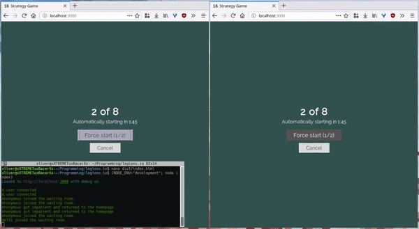

# Strategy-Game

An .io style HTML5 multiplayer strategy hexagon grid based game.

Built on node.js, socket.io and express with a few other odds and ends.

Demo:

## Logistics

Refer to txt/documentation.txt

## Setup

You will need git, node.js, npm and grunt.

Go to your parent directory of choice

`cd C:\Users\You\Your\Directory`

Clone the repo into your directory; it'll add a folder Strategy-Game

`git clone https://github.com/OliverBalfour/Strategy-Game.git`

Go into the new dir

`cd Strategy-Game`

Install dependencies (socket.io, express, and a few other bits and bobs)

`npm install`

Run the server

`node index PORT_NO`

`PORT_NO` is optional, defaults to 3000

Then navigate to [localhost:3000](http://localhost:3000) (assuming you're using port 3000, otherwise replace with PORT_NO)

If you don't have git, download this repo, unzip and put into your directory of choice, then run all commands after the git clone command. Or just get git. It's awesome. If you don't have node.js, don't even bother.

## Useful commands

`grunt` - Build /dist and run tests

`grunt test` - Run tests

`grunt watch` - Automatically build /dist whenever a change is made to files in /client

`node linecount` - Automatically counts length in lines of code of all files in /server and /client, and a few others

## License

My precious... Without my explicit permission, you may not use, have a copy of, distribute, modify or in any other way make use of the source code.

Copyright Oliver Balfour 2016
